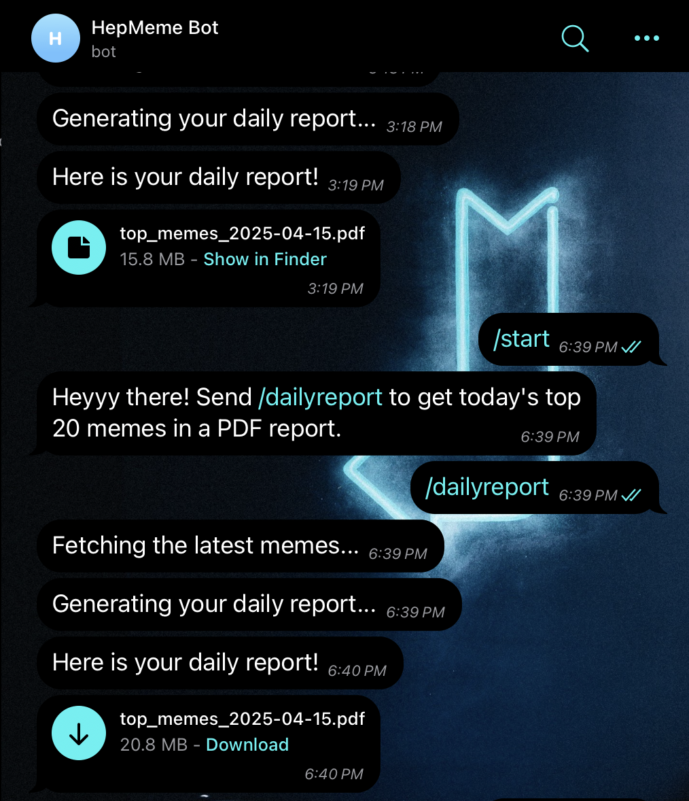

# HepMeme Bot 📰

A Telegram bot that scrapes Reddit’s top 20 memes from the past 24 hours, stores them in a local database, generates a visual PDF report (with chart and images), and delivers it to the user via Telegram.

## 🚀 Features

- 📥 Scrapes top 20 posts from [r/memes](https://www.reddit.com/r/memes) using Reddit API
- 🧠 Stores meme data in a SQLite database with historical tracking
- 📊 Generates a clean, structured PDF report with embedded images and an upvote distribution chart
- 🤖 Sends the report to the user via a Telegram bot command
- 🔒 Uses `.env` and `config.py` for secure and configurable execution
- 📋 Logged workflow with `bot.log` for debugging and transparency

---

## 🗂️ Project Structure

```bash
.
├── reddit_scraper.py          # Crawls Reddit and updates database
├── Hepmil-Telegram.py         # Telegram bot logic and report generation
├── config.py                  # Centralized constants and paths
├── memes.db                   # SQLite database (auto-created)
├── .env                       # API tokens and secrets (not committed)
├── bot.log                    # Execution logs
├── README.md                  # Project documentation
```

---

## 📸 Telegram Demo

  
_Command: `/dailyreport` → Generates and sends the latest PDF._

---

## 🧾 Requirements

- Python 3.9+
- `praw`, `reportlab`, `matplotlib`, `python-telegram-bot`, `python-dotenv`

Install all dependencies:

```bash
pip install -r requirements.txt
```

---

## 🔐 Setup

1. **Create Reddit App**  
Go to [https://www.reddit.com/prefs/apps](https://www.reddit.com/prefs/apps) and register a **script-type** app.

2. **Create Telegram Bot**  
Use [@BotFather](https://t.me/botfather) to create a bot and get your `TELEGRAM_TOKEN`.

3. **Environment Variables**  
Create a `.env` file:

```env
REDDIT_CLIENT_ID=your_id
REDDIT_CLIENT_SECRET=your_secret
REDDIT_USER_AGENT=script:hepmil-meme-crawler:v1.0 (by /u/your_username)
TELEGRAM_TOKEN=your_bot_token
```

---

## 🧠 How It Works

1. User sends `/dailyreport` to the Telegram bot
2. Bot triggers `reddit_scraper.py` to fetch and store top 20 memes
3. Bot queries the latest data from `memes.db`
4. `reportlab` generates a PDF with meme content and upvote chart
5. Bot sends the report as a file to the user

---

## 💡 Actionable Use Cases

- **Trend Timing Analysis** – See when memes tend to go viral
- **Top Creator Insights** – Identify frequent top performers
- **Content Format Tracking** – Analyze what type of meme content trends most

---

## 🤖 AI Usage Disclosure

This project used ChatGPT (OpenAI) to assist in:

- Structuring README & documentation
- Designing PDF layouts and logging architecture
- Debugging and modularizing code

All system logic, development, and testing were implemented independently.

---

## 📬 Contact

**Developer:** Darren Chang  
**Submitted to:** HEPMIL Singapore – Technical Assignment  
**Date:** April 15, 2025
